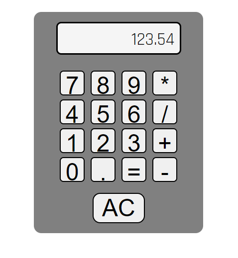

# MakeShift Calculator

## Overview

The MakeShift Calculator 1-day project is my simple reintroductory to coding project. this took me about 4 full focused hours in order to complete, as it was mostly shaking the rust off my brain for functions and logic based coding. Please take a look at my code and tear it apart! Any criticism will be greatly appreciated.

